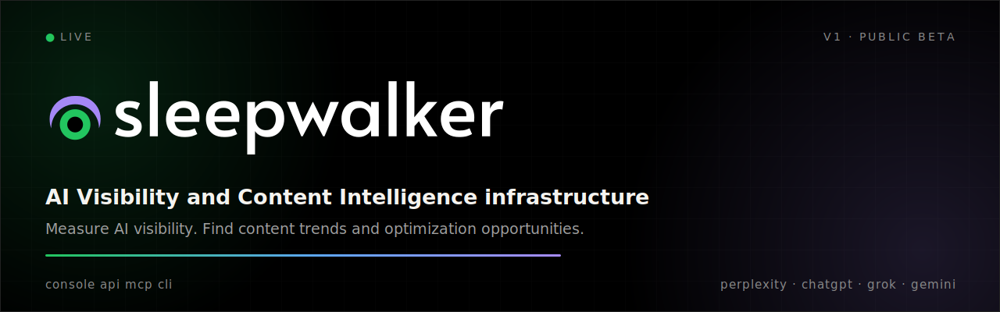
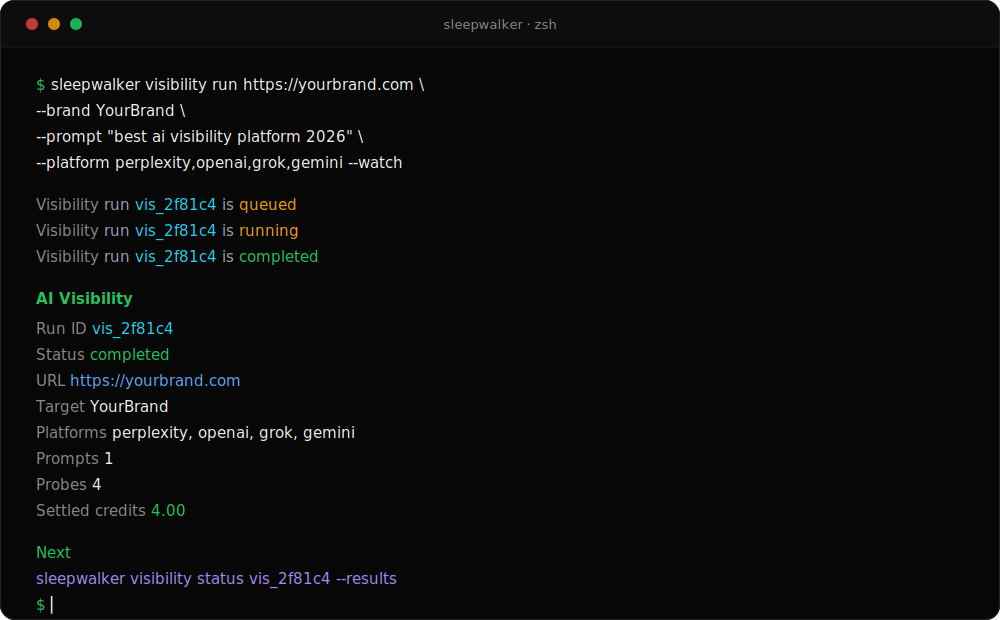
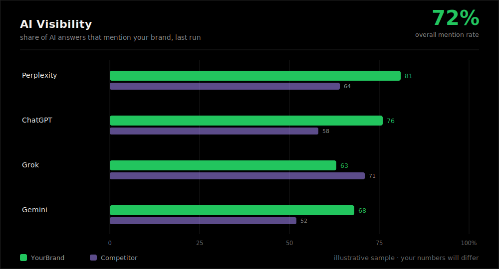
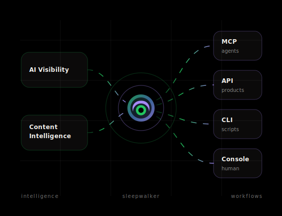

<p align="center">
  
</p>

<p align="center">
  <a href="https://github.com/followanton/sleepwalker/actions/workflows/ci.yml"></a>
  
  
  
  
</p>

<p align="center">
  <b>AI Visibility and Content Intelligence for agents, products, and teams.</b><br>
  Run AI-search checks, inspect citations, score content, and save every result in one workspace.
</p>

<p align="center">
  <a href="https://www.sleepwalker.ai/">Website</a> ·
  <a href="https://app.sleepwalker.ai">App</a> ·
  <a href="https://www.sleepwalker.ai/docs/">Docs</a> ·
  <a href="https://www.sleepwalker.ai/docs/mcp/">MCP</a> ·
  <a href="https://www.sleepwalker.ai/docs/api/">API</a> ·
  <a href="https://www.sleepwalker.ai/docs/cli/">CLI</a> ·
  <a href="docs/cookbook.md">Cookbook</a>
</p>

---

Sleepwalker helps teams understand how AI systems talk about a brand and what content needs to change. It combines two connected workflows:

- **AI Visibility** - run prompts across ChatGPT, Perplexity, Grok, and Gemini; capture full answers, citations, competitors, and mention types.
- **Content Intelligence** - serialize public pages, discover demand, score content depth and freshness, and return practical recommendations.

You can run the same work from the hosted app, the public API, MCP clients, or the CLI. Results stay connected, so a run started by an agent can be reviewed later in the app or queried from code.

This repository is the public developer surface for Sleepwalker: CLI package, API examples, MCP setup notes, and short guides. The hosted engine, app source, database schema, provider integrations, and billing systems are private.

## Quickstart

```bash
npm install -g @sleepwalkerai/cli
sleepwalker init
```

Or run one command without installing:

```bash
npx -y @sleepwalkerai/cli doctor
```

Create an API key in the [Sleepwalker app](https://app.sleepwalker.ai), then run your first visibility check:

```bash
sleepwalker auth key set sw_api_live_...
sleepwalker doctor
sleepwalker visibility run https://yourbrand.com \
  --brand YourBrand \
  --prompt "best ai visibility platform 2026" \
  --platform perplexity,openai,grok,gemini \
  --watch
```

<p align="center">
  
</p>

Want to see the shape of the data first? Open [`docs/responses.md`](docs/responses.md) for full example outputs from serialization, prompt suggestions, AI Visibility, Content Intelligence, and report lookup.

## What You Can Build

<p align="center">
  
</p>

- **AI Search (GEO) monitoring**: Setup prompt tracking against specific URLs across ChatGPT, Perplexity, Grok and Gemini.
- **Agent workflows**: let MCP-capable clients (such as Claude) get access to vast Sleepwalker data, featuring LLM answers, cited domains, competitor performance, content trends and much more.
- **Product integrations**: use the API from internal tools, client portals, reporting pipelines, or automated QA checks.
- **In-depth content review**: inspect what a page says, which trends it misses, and what should be fixed first.
- **Mix and match Sleepwalker capabilities**: Create custom skills and workflows involving other MCPs to match your business requirements.

## Access Paths

| Surface | Best for | Entry point |
|---|---|---|
| App | Human review, credits, keys, and full result views | [app.sleepwalker.ai](https://app.sleepwalker.ai) |
| API | Scripts, products, scheduled jobs, and reporting workflows | [API docs](https://www.sleepwalker.ai/docs/api/) |
| MCP | Claude and other MCP-capable agents | [MCP setup](https://www.sleepwalker.ai/docs/mcp/) |
| CLI | Terminal workflows and automation | [CLI docs](https://www.sleepwalker.ai/docs/cli/) |

<p align="center">
  
</p>

## Run It From Anywhere

**CLI**

```bash
sleepwalker visibility run https://yourbrand.com \
  --brand YourBrand \
  --prompt "best ai visibility platform 2026" \
  --platform perplexity,openai,grok,gemini \
  --watch
```

**API**

```bash
curl -s https://api.sleepwalker.ai/v1/visibility/runs \
  -H "Authorization: Bearer $SLEEPWALKER_API_KEY" \
  -H "Content-Type: application/json" \
  -d '{
    "url": "https://yourbrand.com",
    "target_entity": "YourBrand",
    "prompts": ["best ai visibility platform 2026"],
    "platforms": ["perplexity","openai","grok","gemini"]
  }'
```

**MCP**

```text
https://mcp.sleepwalker.ai/mcp
```

Ask an MCP-capable client: `Check how YourBrand appears across AI search this week.`

**App**

Open [app.sleepwalker.ai](https://app.sleepwalker.ai) for the visual workflow, saved results, credits, and keys.

## Developer Resources

| Path | What it shows |
|---|---|
| [`docs/agents.md`](docs/agents.md) | MCP tool catalog and agent workflow walkthrough |
| [`docs/concepts.md`](docs/concepts.md) | Runs, probes, serialization, scoring, credits |
| [`docs/cookbook.md`](docs/cookbook.md) | Runnable workflows, including CI checks |
| [`docs/responses.md`](docs/responses.md) | Full example outputs for the main Sleepwalker actions |
| [`examples/api/curl`](examples/api/curl) | One-call examples for public API actions |
| [`examples/api/javascript`](examples/api/javascript) | Raw `fetch` plus a zero-dependency client helper |
| [`examples/api/python`](examples/api/python) | `urllib` examples plus a small client class |
| [`examples/mcp`](examples/mcp) | OAuth and bearer-token setup notes |

## Credits

Sleepwalker is pay as you go. Reads, lists, and status polling are normally unmetered. Actions that run work, such as visibility checks, content scoring, and serialization, use prepaid credits. Details live in [docs/credits.md](docs/credits.md) and the hosted [billing docs](https://www.sleepwalker.ai/docs/billing/credits/).

## Repository Boundary

This repository is intentionally small.

| Public here | Private in Sleepwalker |
|---|---|
| CLI, examples, setup notes, short docs | Hosted engine and app source |
| Public API request shapes | MCP server implementation |
| MCP client connection examples | Database schema and billing internals |
| Product-level credit behavior | Provider integrations and routing |

Do not commit real keys. Use environment variables or the CLI key store:

```bash
export SLEEPWALKER_API_KEY=sw_api_live_...
```

## Links

- Website: [sleepwalker.ai](https://www.sleepwalker.ai/)
- App: [app.sleepwalker.ai](https://app.sleepwalker.ai)
- Docs: [sleepwalker.ai/docs](https://www.sleepwalker.ai/docs/)
- npm: [@sleepwalkerai/cli](https://www.npmjs.com/package/@sleepwalkerai/cli)
- Security policy: [SECURITY.md](SECURITY.md)
- Contributing: [CONTRIBUTING.md](CONTRIBUTING.md)
- License: [MIT](LICENSE)
