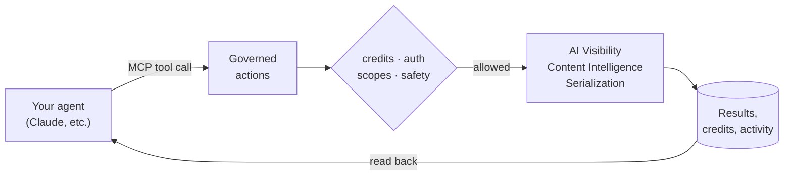

# Sleepwalker for agents

Sleepwalker is agent-native. It is not a dashboard with an API stapled on. Every action runs through the same governed layer whether a human clicks it or an agent calls it, so you can hand an AI agent a real job ("watch how our brand shows up in AI search and tell me what to fix") and trust that it spends credits safely and leaves an audit trail.

## The loop



Connect once, then talk to your agent in plain language. The agent picks the right tool, the governed layer decides whether the action is allowed, and results are saved so any surface can read them later.

## Connect

Hosted endpoint:

```text
https://mcp.sleepwalker.ai/mcp
```

- **OAuth** is the recommended flow for clients that support it (Claude and most connector platforms). You sign in to Sleepwalker and authorize access. No long-lived token to copy. See [examples/mcp/oauth.md](../examples/mcp/oauth.md).
- **Bearer token** is available for custom or local clients. Create an MCP token in the Console and pass it as `Authorization: Bearer sw_mcp_live_...`. See [examples/mcp/bearer-token.md](../examples/mcp/bearer-token.md).

> [!NOTE]
> Hosted OAuth is designed to request the Sleepwalker read and action scopes, so the tools advertised by the connector work out of the box. Billable actions still require prepaid credits and are recorded in Activity. Bearer-token setups can be scoped more narrowly for custom clients.

## Tool catalog

**Read (free)**

| Tool | What it does |
|---|---|
| `list_sleepwalker_tests` | List your saved tests |
| `get_sleepwalker_test_results` | Read results for a saved test |
| `get_sleepwalker_reports_by_url` | Find recent reports for a URL |
| `list_sleepwalker_visibility_runs` | List AI Visibility runs |
| `get_sleepwalker_visibility_run_status` | Status and results for a run |
| `list_sleepwalker_content_runs` | List Content Intelligence runs |
| `get_sleepwalker_content_run_status` | Status and result for a run |
| `get_sleepwalker_prompt_response` | The full answer for one probe |
| `get_sleepwalker_summaries` | Roll-up summaries |
| `get_sleepwalker_consistent_recommendations` | Recommendations that hold across runs |

**Actions (prepaid credits)**

| Tool | What it does | Credit behavior |
|---|---|---|
| `serialize_sleepwalker_page_content` | URL to clean structured content | Billable action |
| `suggest_sleepwalker_visibility_prompts` | Prompt ideas for a brand | Billable action |
| `create_sleepwalker_visibility_run` | Queue an AI Visibility run | Billable by probe |
| `discover_sleepwalker_content_trends` | Find relevant demand for a page | Billable action |
| `score_sleepwalker_content` | Score a page, get fixes | Billable action |
| `create_sleepwalker_content_run` | Persisted Content Intelligence run | Billable run |

The Console and hosted billing docs are the source of truth for pricing.

## Walkthrough: ask Claude to watch your brand

Once Sleepwalker is connected in Claude, this is a real conversation, not pseudocode.

> **You:** Check how "YourBrand" shows up in AI search for buyer questions about our category. Use Perplexity and ChatGPT.

Claude calls `suggest_sleepwalker_visibility_prompts` for your site, picks a handful of buyer-intent prompts, then calls `create_sleepwalker_visibility_run` with those prompts on `perplexity` and `openai`. It polls `get_sleepwalker_visibility_run_status` until the run completes.

> **Claude:** Across 6 prompts on Perplexity and ChatGPT, YourBrand appeared in 4 of 12 answers (33%). Perplexity cited you twice. ChatGPT mentioned a competitor in 5 of 6 answers and never cited you. Want me to find why?

> **You:** Yes, check our pricing page.

Claude calls `score_sleepwalker_content` on your pricing URL, reads the gaps, and comes back with specific fixes ranked by impact, plus the run IDs so you can open the full evidence in the Console.

That whole exchange is governed: scoped access, prepaid credits, every call audited, and the results saved so your weekly report or your code can read the same data later.

## Make it recurring

Point a scheduled agent at the same tools to get a standing brand-in-AI monitor. A weekly run, a short diff against last week, and a note when your mention rate moves. The [cookbook](cookbook.md) has a code version of the same idea.

## Where results live

Anything an agent runs shows up in the Console with full drilldowns, and is readable through the API and CLI. One run, one bill, every surface.
